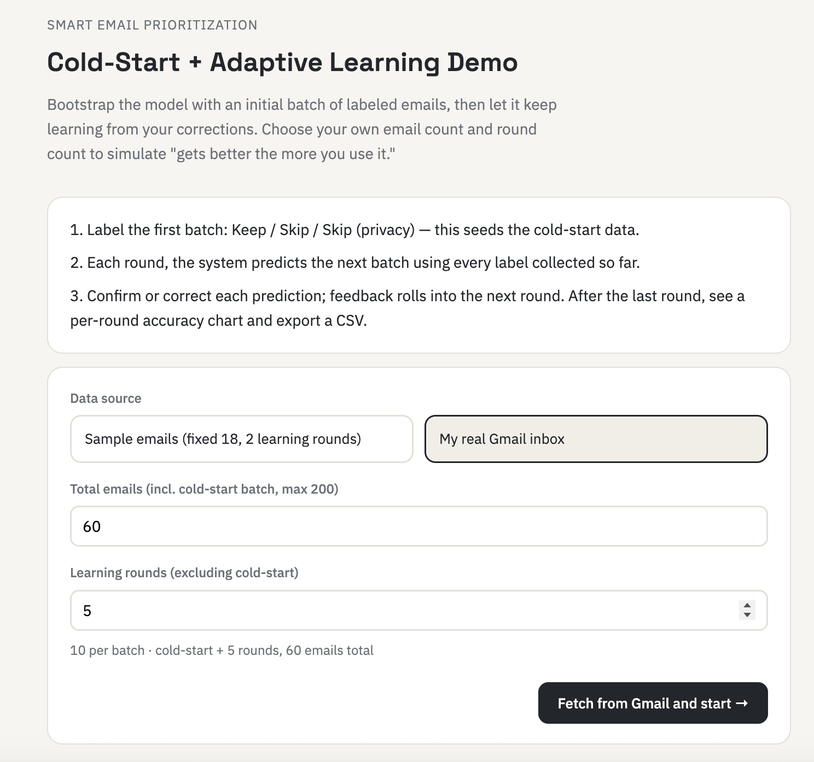
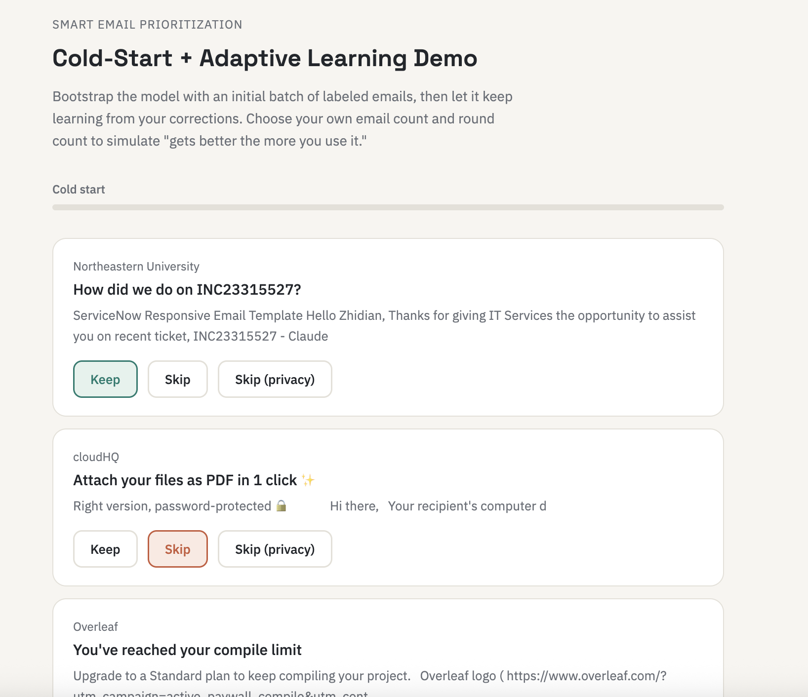
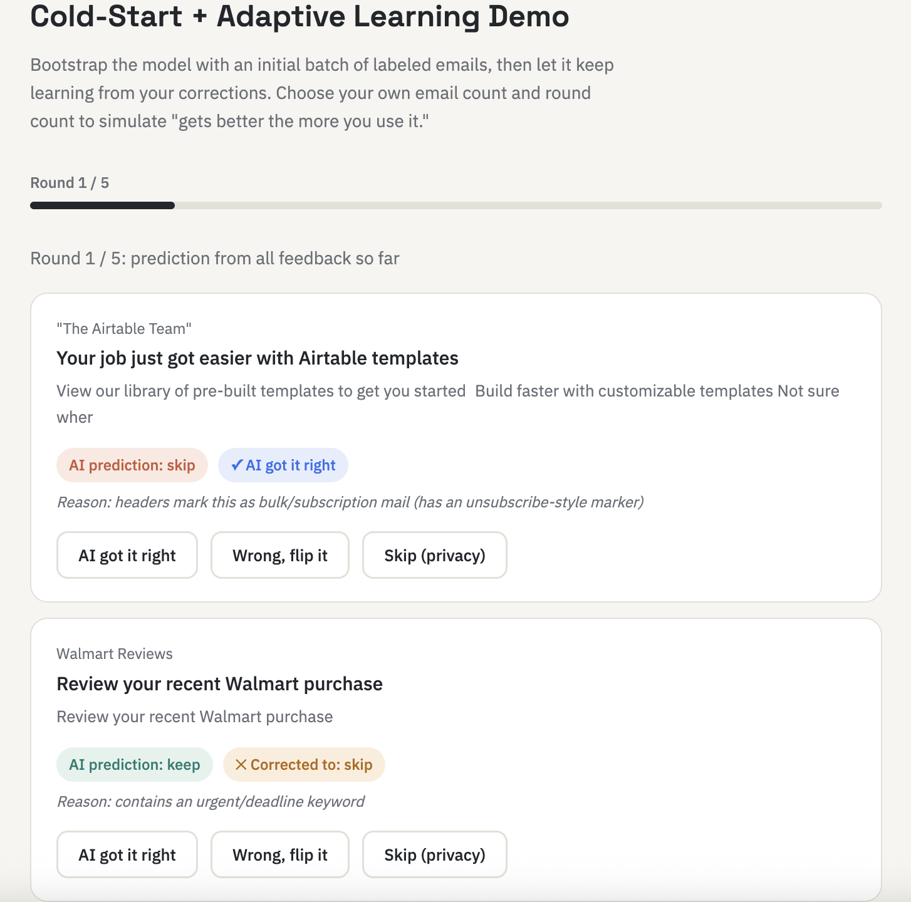
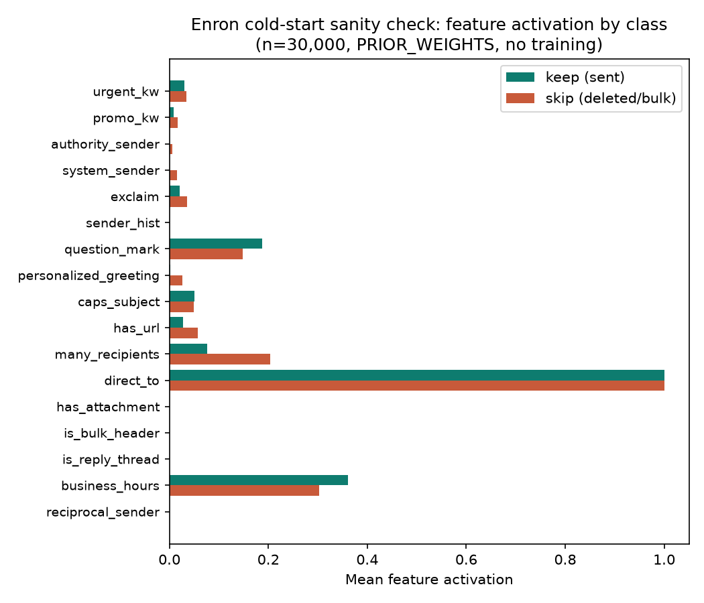
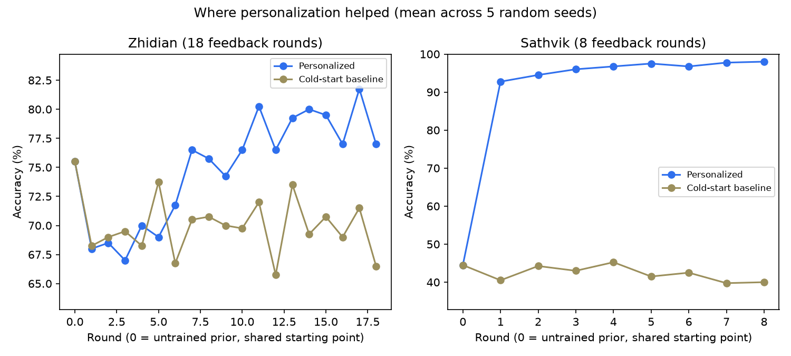
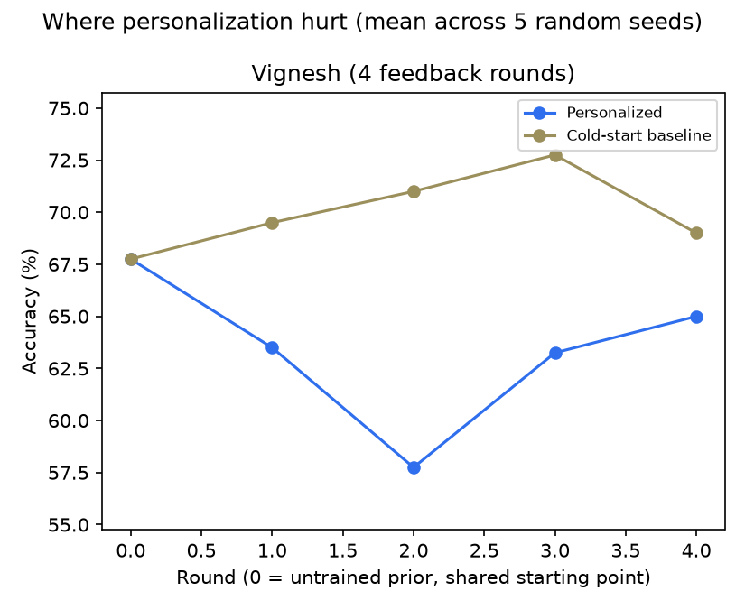

# Smart Email Prioritization

Inbox overload is a well-known problem, but unlike spam, what counts as a "priority" email is personal, not universal — a newsletter one person deletes on sight is exactly what another opens first. This project is a fully local, privacy-preserving email-priority classifier: a small, hand-designed 18-feature logistic regression, initialized from a hand-tuned general-purpose cold-start prior and then personalized to an individual user via online gradient descent on their own Keep/Skip feedback — entirely on the user's machine, with no email content or Gmail credentials ever sent to a third party.

We built this rather than assuming it was the right design: using three real, independently collected and labeled Gmail datasets, we empirically compared it against two alternatives we also implemented — a variant that mines extra term features from the public Enron corpus via TF-IDF, and a general-purpose LLM (Claude Haiku 4.5) prompted with no hand-designed features at all. The hand-crafted model won on measured, held-out accuracy against both, stayed fully explainable, and had zero marginal inference cost, while the Enron-mined vocabulary turned out to memorize corpus-specific employee names rather than a transferable notion of importance, and the LLM traded away precision for perfect recall at a real per-classification dollar cost and latency. We also found personalization itself isn't a safe default: it produced a clear accuracy gain on one dataset and a clear loss on a smaller one, most likely because too little accumulated feedback gives the model nothing reliable to learn from.

Full methodology, related work, and results are in [`latex/report.tex`](latex/report.tex) (the project report); this README covers how to run the code.

---

This folder contains three standalone tools plus a shared backend. They all run **entirely on your own machine** — nothing is sent to a third-party AI, and your Gmail password never leaves your computer.

| File | Who runs it | What it does |
|---|---|---|
| `backend/app.py` | Everyone | The shared model: cold-start rules + an online logistic-regression-style classifier. Everything else talks to this over `localhost:8000`. |
| `email_priority_demo.html` | Whoever is presenting | The click-through demo: label a batch, watch AI predict the next batch, correct it, repeat. Good for a live walkthrough. |
| `email_extractor.html` | **Every teammate, on their own inbox** | Fetches a batch of your own emails, you label each Keep / Skip / Skip (privacy), then it exports a small `.json` file. |
| `email_priority_test.html` | Whoever is compiling results | Imports one or more `.json` files exported by the extractor (from any number of teammates), pools them, and automatically replays the learning curve across many random shuffles to produce a chart + CSV. No Gmail needed here. |

The point of splitting extractor vs. test tool: data collection (slow, manual, needs your own Gmail) and statistical testing (fast, automatic, needs no credentials) are decoupled. Label once, then anyone can re-run experiments with different batch sizes/trial counts on the same data without re-labeling.

## Demo screenshots

`email_priority_demo.html` running end-to-end against a real Gmail inbox:

| Setup | Cold-start labeling | Round predictions |
|---|---|---|
|  |  |  |

## Report figures

The three figures used in `latex/report.tex`:

| Enron feature activation (cold-start prior, no training) | Personalization helped: Zhidian & Sathvik | Personalization hurt: Vignesh |
|---|---|---|
|  |  |  |

## 1. One-time setup (each person does this on their own machine)

**Requirements:** Python 3.9+, a personal Gmail account (recommended — school Google Workspace accounts sometimes have IMAP/app-passwords disabled by the admin).

```bash
cd backend
python3 -m venv venv
venv/bin/pip install -r requirements.txt
```

### Generate a Gmail App Password (only needed if you'll fetch your own inbox with the extractor)

1. Turn on 2-Step Verification: https://myaccount.google.com/security
2. Generate an app password: https://myaccount.google.com/apppasswords — name it anything (e.g. "email-priority"), copy the 16-character password **immediately** (Google only shows it once — if you lose it, delete it there and generate a new one).
3. In `backend/`, copy the template and fill it in yourself (don't paste the password into Slack/email — just edit the file directly):
   ```bash
   cp .env.example .env
   ```
   Edit `.env`:
   ```
   GMAIL_ADDRESS=your_email@gmail.com
   GMAIL_APP_PASSWORD=your16digitpassword
   ```

If you only plan to use `email_priority_test.html` (importing files someone else collected), you can skip the app password entirely — that tool never touches Gmail.

## 2. Run the backend

```bash
cd backend
venv/bin/uvicorn app:app --port 8000 --reload
```

Leave this running. Check it's alive: open http://127.0.0.1:8000/health in a browser — should show `{"status":"ok"}`.

## 3. Serve the HTML files

From the project root (a separate terminal, backend still running):
```bash
python3 -m http.server 5500
```
Then open in your browser:
- http://127.0.0.1:5500/email_extractor.html — to collect your own labeled data
- http://127.0.0.1:5500/email_priority_test.html — to run experiments on collected data
- http://127.0.0.1:5500/email_priority_demo.html — the presentation demo

Use this `http.server` route rather than double-clicking the files open — opening them directly as `file://` pages is not guaranteed to work (some browsers block or restrict fetch() calls from `file://` origins) and hasn't been tested.

## 4. Collecting data (each teammate)

1. Open `email_extractor.html`.
2. Enter your name (used in the exported filename).
3. Pick "My real Gmail inbox," choose how many emails to fetch (try 40–60 to start), click fetch.
4. Every email defaults to **Skip** — you don't need to click anything for most of them. Only click **Keep** for emails you'd actually want surfaced, or **Skip (privacy)** for anything you don't want counted or shared (note: the subject/snippet text is still stored in the exported file even for privacy-skips, so if an email is genuinely sensitive, open the exported `.json` afterward and delete that entry by hand before sending it on).
5. Click **Export labeled data** at any point — no need to review every card first, downloads a `labeled_<yourname>_<count>.json` file.
6. Send that file to whoever is compiling results (Slack, email, shared drive — it contains subject lines and short snippets, not full email bodies or your password).

## 5. Running experiments (whoever compiles results)

1. Open `email_priority_test.html`.
2. Import as many teammates' `.json` files as you have — they get pooled into one combined dataset.
3. Set batch size (emails per round) and number of random-shuffle trials (8 is a reasonable default; more trials = smoother average, slower run).
4. Click **Run experiment**. It calls the backend once per round per trial — no more clicking needed.
5. Read the chart/table, and click **Download raw CSV** — one row per (trial, round), so you can pool multiple experiment runs (e.g. different batch sizes) in Excel/pandas for the report.

## 6. Reproducing the report's figures and tables

These are the standalone scripts behind the report's quantitative results (Sections 8–9) — separate from the HTML tools above, and requiring no browser:

```bash
cd backend
venv/bin/python gmail_eval/make_figures.py          # Figures 1 and 2 (personalization learning curves)
venv/bin/python llm_eval/claude_classify.py --labeled ~/Downloads/labeled_Zhidian_200.json   # Table 2 (hand-crafted vs. Claude API)
venv/bin/python enron/evaluate_prior.py --labeled enron/enron_labeled.json                    # Enron cold-start sanity check
```

`llm_eval/claude_classify.py` calls the real Claude API and needs `ANTHROPIC_API_KEY` set in `backend/.env`. `gmail_eval/make_figures.py` expects the three labeled exports at `~/Downloads/labeled_Zhidian_200.json`, `~/Downloads/labeled_Vignesh_60.json`, and `~/Downloads/labeled_Sathvik_100.json` (the default download location the extractor tool saves to); it writes figures to `figures/` at the project root.

## Troubleshooting

- **"Missing GMAIL_ADDRESS or GMAIL_APP_PASSWORD"** — you haven't filled in `backend/.env`, or the backend was started before you saved it (restart uvicorn after editing `.env`).
- **"Gmail login failed"** — the app password was revoked/retyped wrong, or 2-Step Verification got turned off. Generate a fresh app password.
- **Fetching 200 emails is slow** — expected, roughly 30–40 seconds; the UI shows a spinner. It's one batched IMAP call, not one-per-email, so it won't be much slower than that regardless of count up to the 200 cap.
- **Import fails in the test tool** — the file must be the exact JSON the extractor produced (has an `emails` array with `from`/`subject`/`snippet`/`label` per item). Don't hand-edit the structure, just individual entries if removing something sensitive.
- **"Not enough labeled emails for even one round"** — you need at least `2 × batch size` usable (non-privacy-skip) labels in the combined pool. Import more data or lower the batch size.
